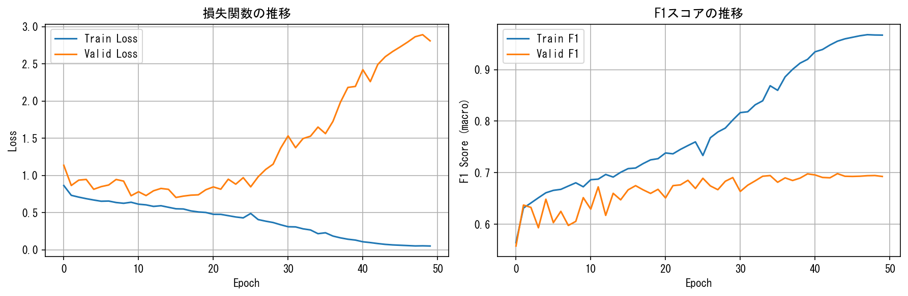
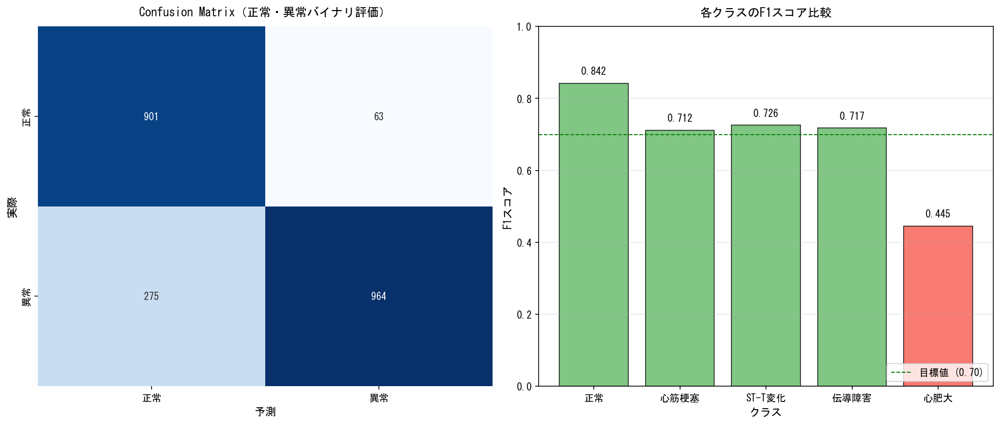
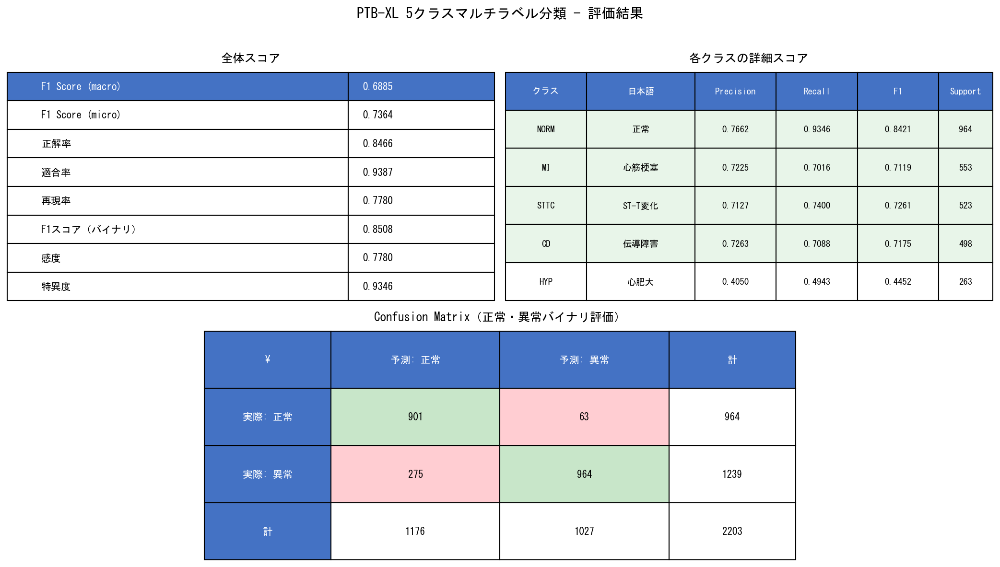
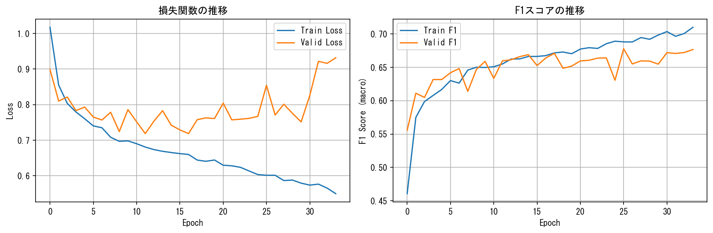
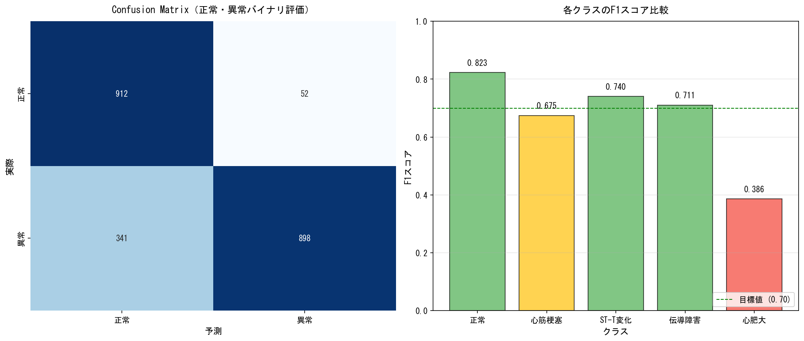
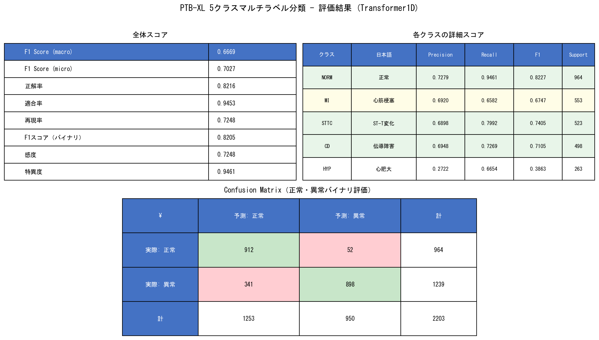

# ECG Classification: 1D-ResNet vs Transformerによる心電図分類

PTB-XLデータセットを使用した心電図（ECG）の5クラスマルチラベル分類

## データセット

- **PTB-XL** (Physikalisch-Technische Bundesanstalt ECG Dataset)
- データセットURL: https://physionet.org/content/ptb-xl/1.0.3/
- ライセンス: **CC BY 4.0**（商用利用OK、帰属必要）
- サンプリング: 100Hz
- データ数: **21,837件**（Train: 17,441件、Valid: 2,193件、Test: 2,203件）
- 導出数: 12-lead ECG
- 信号長: 10秒（1000サンプル）
- ラベル数: 5クラス（NORM, MI, STTC, CD, HYP）

### ライセンスについて
- **CC BY 4.0**（帰属必要）

> **帰属表記**: PTB-XL Diagnostic ECG Database by PhysioNet (CC BY 4.0)

## PTB-XLの5スーパークラス

PTB-XLでは公式に5つのスーパークラスが定義されています：

| 5クラス | 説明 | 含まれる疾患 |
|--------|------|-------------|
| **NORM** | 正常な心電図 | 正常洞調律 |
| **MI** | 心筋梗塞 | ST上昇/非ST上昇心筋梗塞 |
| **STTC** | ST-T変化 | ST低下/上昇、T波逆転 |
| **CD** | 伝導障害 | 房室ブロック、脚ブロック |
| **HYP** | 心肥大 | 左室肥大、右室肥大 |

### マルチラベル分類

PTB-XLは複数のラベルを持つレコードが存在するため、マルチラベル分類として扱います。

## モデルアーキテクチャ

- **1D-ResNet** (ECG時系列信号用)
- 入力: 12-lead ECG (12チャンネル × 1000サンプル)
- 出力: 5クラス（マルチラベル、BCEWithLogitsLoss）
- 正則化: Dropout (0.3) + Batch Normalization
- オプティマイザ: AdamW (lr=1e-3, weight_decay=1e-4)
- スケジューラ: OneCycleLR (max_lr=5e-3)

### 過学習対策

- Dropoutを各ResBlockと最終層に追加 (0.3)
- Early Stopping (Valid F1監視、patience=8)
- クラス不均衡対策: pos_weight (HYPを2倍強化)

## 事前準備

### 必要なパッケージインストール

```bash
pip install torch torchvision --index-url https://download.pytorch.org/whl/cu121
pip install kagglehub pandas numpy matplotlib scikit-learn jupyter
```

主なパッケージ:
- **kagglehub** (Kaggleデータセットダウンロード - 認証不要)
- torch, torchvision
- scikit-learn
- matplotlib
- jupyter

### Jupyter起動

```bash
jupyter notebook
```

## 使い方

### ノートブック実行

1. `notebooks/01_データ確認.ipynb` - データダウンロード・確認
2. `notebooks/02_ResNet学習.ipynb` - 1D-ResNetで学習
3. `notebooks/03_Transformer学習.ipynb` - 1D-Transformerで学習

### 結果ファイルの保存

- **ResNet1D**:
  - 学習済みモデル: `models/resnet1d_ptbxl.pth`
  - 学習曲線: `images/resnet1d_learning_curve.png`
  - 評価結果可視化: `images/resnet1d_evaluation.png`
  - 評価結果表: `images/resnet1d_results_table.png`
- **Transformer1D**:
  - 学習済みモデル: `models/transformer1d_ptbxl.pth`
  - 学習曲線: `images/transformer1d_learning_curve.png`
  - 評価結果可視化: `images/transformer1d_evaluation.png`
  - 評価結果表: `images/transformer1d_results_table.png`
- **CSV結果ファイル**:
  - `results/transformer1d_test_results.csv` - テスト評価結果（全体）
  - `results/transformer1d_class_results.csv` - 各クラスの詳細
  - `results/transformer1d_training_history.csv` - 学習履歴
  - `results/resnet_vs_transformer.csv` - モデル比較

## 結果

### ResNet1Dの結果

#### テスト精度（全データ: 21,837件）

| 指標 | スコア |
|------|--------|
| **F1 Score (macro)** | **0.6885** |
| **F1 Score (micro)** | **0.7364** |

#### 各クラスのF1スコア

| クラス | 日本語 | F1スコア | Precision | Recall | Support |
|--------|--------|----------|-----------|--------|---------|
| **NORM** | 正常 | **0.8421** | 0.77 | 0.93 | 964 |
| **MI** | 心筋梗塞 | **0.7119** | 0.72 | 0.70 | 553 |
| **STTC** | ST-T変化 | **0.7261** | 0.71 | 0.74 | 523 |
| **CD** | 伝導障害 | **0.7175** | 0.73 | 0.71 | 498 |
| **HYP** | 心肥大 | **0.4452** | 0.40 | 0.49 | 263 |

#### 正常・異常バイナリ評価

| 指標 | スコア |
|------|--------|
| **正解率** | **0.8466** |
| **適合率** | **0.9387** |
| **再現率** | **0.7780** |
| **F1スコア** | **0.8508** |
| **感度** | 0.7780 (異常の見逃しなし率) |
| **特異度** | 0.9346 (正常の正しい識別率) |

#### 学習曲線

**1D-ResNet (PTB-XL, 21,837件)**



#### 評価結果可視化

**Confusion Matrix（バイナリ評価）と各クラスのF1スコア**



**評価結果表（全体スコア・各クラス詳細・Confusion Matrix）**



---

### Transformer1Dの結果

#### テスト精度（全データ: 21,837件）

| 指標 | スコア |
|------|--------|
| **F1 Score (macro)** | **0.6669** |
| **F1 Score (micro)** | **0.7027** |

#### 各クラスのF1スコア

| クラス | 日本語 | F1スコア | Precision | Recall | Support |
|--------|--------|----------|-----------|--------|---------|
| **NORM** | 正常 | **0.8227** | 0.73 | 0.95 | 964 |
| **MI** | 心筋梗塞 | **0.6747** | 0.69 | 0.66 | 553 |
| **STTC** | ST-T変化 | **0.7405** | 0.69 | 0.80 | 523 |
| **CD** | 伝導障害 | **0.7105** | 0.69 | 0.73 | 498 |
| **HYP** | 心肥大 | **0.3863** | 0.27 | 0.67 | 263 |

#### 正常・異常バイナリ評価

| 指標 | スコア |
|------|--------|
| **正解率** | **0.8216** |
| **適合率** | **0.9453** |
| **再現率** | **0.7248** |
| **F1スコア** | **0.8205** |
| **感度** | 0.7248 (異常の見逃しなし率) |
| **特異度** | 0.9461 (正常の正しい識別率) |

#### 学習曲線

**1D-Transformer (PTB-XL, 21,837件)**



#### 評価結果可視化

**Confusion Matrix（バイナリ評価）と各クラスのF1スコア**



**評価結果表（全体スコア・各クラス詳細・Confusion Matrix）**



---

## 動作環境

- GPU: NVIDIA RTX 3060 (12GB)
- CUDA: 12.1
- PyTorch: 2.10.0

> **注**: GPUなしでも動作しますが、学習には時間がかかります。

## 注意・免責事項

- 本プロジェクトは**教育的・ポートフォリオ目的**です
- **医療用途での使用は strictly prohibited（厳禁）** です
- PTB-XLデータセットは研究・教育用であり、実臨床データとは異なります

## License

MIT License - 詳細は [LICENSE](LICENSE) を参照

## データセット帰属表記

本プロジェクトでは以下のデータセットを使用しています：

```
タイトル: PTB-XL Diagnostic ECG Database
出典: PhysioNet
URL: https://physionet.org/content/ptb-xl/1.0.3/
ライセンス: CC BY 4.0

論文引用:
Wagner, P., Strodthoff, N., Bousseljot, R., et al. (2020).
PTB-XL: A Large Publicly Available ECG Dataset.
Scientific Data, 7, 154.
```

本プロジェクトでPTB-XLデータセットを使用させていただいたことに感謝いたします。

---

## ResNet vs Transformer 比較

| モデル | Test F1 (macro) | パラメータ数 | 学習時間 |
|--------|-----------------|-------------|---------|
| **ResNet1D** | 0.6885 | 873万 | 5.5分 |
| **Transformer1D** | 0.6669 | 501万 | 5.0分 |

---

*作成日: 2026-03-20*
*データセット: PTB-XL (21,837件)*
